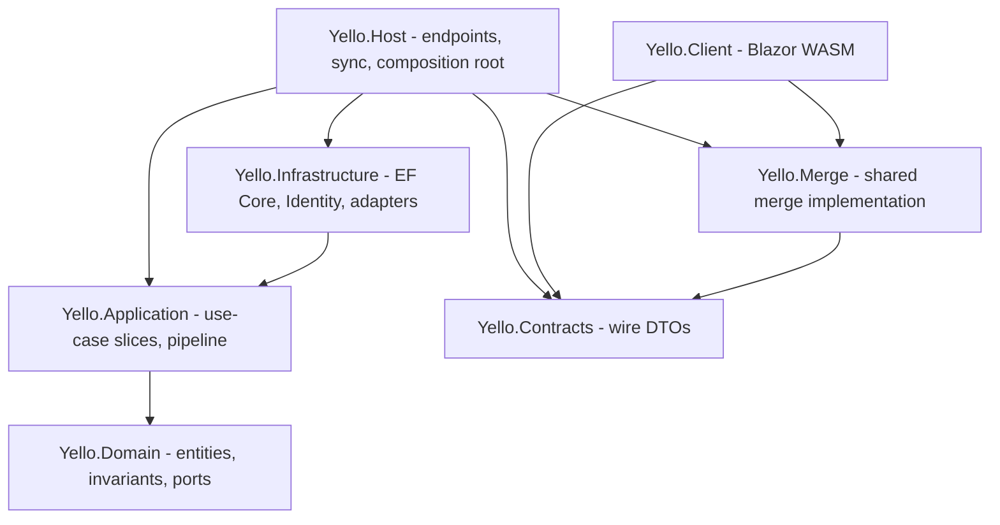
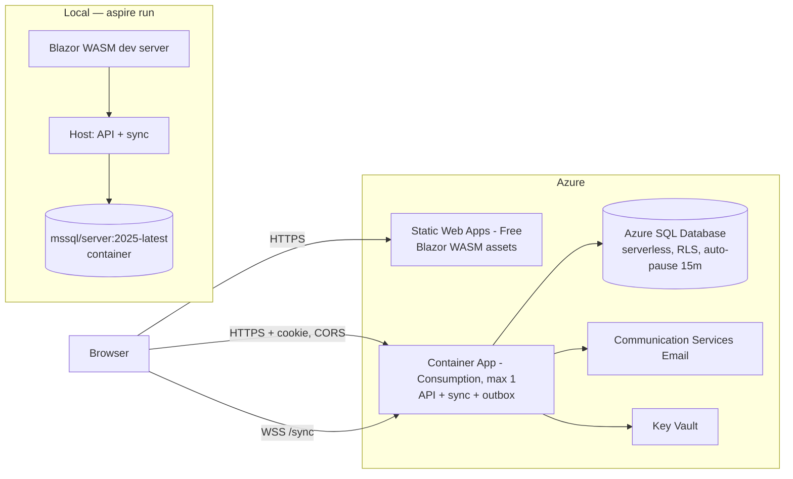
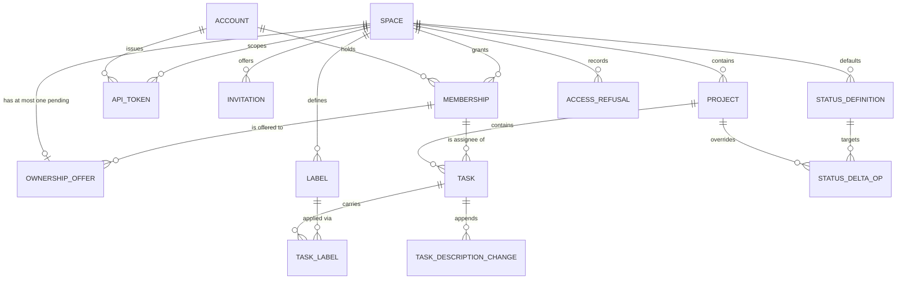

# Architecture Spine — Yello

## Design Paradigm

**Vertical slices inside a hexagonal shell.**

Four rings, dependencies pointing inward only. Inside `Application`, one folder per use case, so a story maps to one folder.

| Ring | Namespace | Holds |
| --- | --- | --- |
| Domain | `Yello.Domain` | Entities, value objects, domain invariants, port interfaces. References nothing. |
| Application | `Yello.Application` | One folder per use case (`Tasks/MoveTaskToProject/`), plus the request pipeline every slice traverses. |
| Infrastructure | `Yello.Infrastructure` | EF Core, Identity, RLS session wiring, merge adapter, email adapter, outbox. |
| Host | `Yello.Host` | Minimal API endpoints, the sync WebSocket endpoint, composition root. |
| Client | `Yello.Client` | Blazor WebAssembly. Shares `Yello.Contracts` and `Yello.Merge` with the server. |

Cross-cutting invariants live in the pipeline, never inside a slice. A slice that re-implements authorisation, Space resolution, refusal recording or idempotency is a defect.



## Invariants & Rules

### AD-1 — Authorisation is a function of (Account, Space), resolved per request from a Membership row

- **Binds:** all — FR-9, FR-15, FR-16, NFR-2
- **Prevents:** one slice reading a Role from a claim while another reads it from the database, collapsing per-Space Roles into a global role.
- **Rule:** Every Space-scoped request resolves an `ActiveSpaceContext` from the authenticated `AccountId` plus the requested `SpaceId` by reading the Membership row, before any authorisation decision. A request whose Space context cannot be resolved — no such Space, or no Membership in it — is refused with **404** (AD-3), never defaulted and never distinguished. Role is never read from a cookie, a claim, an API Token payload, or any cache outliving the request. `[Authorize(Roles = …)]`, `ClaimsPrincipal.IsInRole`, `IdentityRole` and Identity's role store are forbidden; an architecture test fails the build on their presence. ASP.NET Core Identity is used for authentication only — Account store, password hashing, cookie issuance.

### AD-2 — Space scoping is enforced in the database, not the application

- **Binds:** every Space-scoped entity — NFR-1, FR-15, SM-1
- **Prevents:** a slice omitting a Space predicate and leaking across the boundary; the API surface leaking where the UI does not.
- **Rule:** Every Space-scoped table carries a non-nullable `SpaceId` and a row-level security policy filtering on `SESSION_CONTEXT('SpaceId')`.
  - Infrastructure calls `sp_set_session_context 'SpaceId', …, @read_only = 1` at the start of **every unit of work**, from `ActiveSpaceContext` and never from a client-supplied value. It is never set once per connection: a pooled connection reused across two requests for different Spaces is the exact leak this guards against.
  - The database is configured `MAXDOP = 1`. A documented SQL Server defect makes a parallel plan reading `SESSION_CONTEXT()` on a pool-reset session return **another tenant's rows, silently and successfully**. Serial execution removes the class; at NFR-8 scale it costs nothing.
  - EF Core global query filters restate every policy as an **independent** second layer, derived from application state rather than session context, so neither layer alone carries NFR-1. Raw SQL that bypasses global query filters is forbidden outside `Infrastructure`.
  - Cross-entity references inside a Space use composite foreign keys carrying `SpaceId` — an Assignee is `(SpaceId, MembershipId)` — so FR-21's same-Space constraint holds by construction rather than by validation.
  - A Space-scoped table without an RLS policy fails the schema test. The isolation suite includes a **pooled-connection reuse** case: two requests for different Spaces served consecutively on one physical connection.

### AD-3 — The 403/404 line is drawn at the Space boundary and nowhere else

- **Binds:** all read and write paths, both surfaces — FR-15, NFR-1
- **Prevents:** each slice inventing its own refusal code and disclosing existence across Spaces.
- **Rule:** A resource in a Space the caller holds no Membership in returns **404**, identically to a resource that does not exist. A resource in a Space the caller does belong to, refused for Role, returns **403**. No handler converts one into the other. Error bodies carry no Space name, resource title, or existence hint.

### AD-4 — Browser and API traverse one authorisation path

- **Binds:** FR-16, FR-35, FR-36, NFR-1, SM-1
- **Prevents:** the two surfaces drifting so that a rule holds in the browser and not over the API.
- **Rule:** Browser requests and API-Token requests differ only in how `AccountId` and `SpaceId` are established. After that they enter the identical pipeline and the identical slice. No slice branches on calling surface. The isolation suite runs every case against both surfaces; a case that exists for one and not the other is a gap, not a choice.

### AD-5 — Owner uniqueness is a schema guarantee

- **Binds:** FR-3, FR-5, FR-7, FR-8, FR-13, FR-14, FR-42
- **Prevents:** two slices enforcing "exactly one Owner" differently in application code, and transfer passing through zero or two Owners.
- **Rule:** A filtered unique index on `Membership(SpaceId) WHERE Role = Owner` guarantees at most one Owner per Space. Ownership does **not** move in one step: it is an offer the named Membership must accept (AD-26), so the Space holds durable pending state between the two halves. Removing the Owner's Membership is rejected while it holds ownership, and a pending offer does not relax that — making an offer is not itself an exit (FR-8). Account deletion is refused inside the same transaction that checks for owned Spaces. Four deletion behaviours are fixed here because a cascade is the default an implementer reaches for and all four are wrong: a deleted Account leaves a tombstone so authored content keeps attribution (FR-3); removing a Membership does **not** delete Invitations that Membership issued (FR-12); removing a Membership or deleting an Account sets dependent `Task.AssigneeMembershipId` to null and never deletes the Task (FR-21); and those same two events **lapse** a pending Ownership Offer naming that Membership rather than deleting it or leaving it orphaned (FR-8, FR-14, FR-3).

### AD-6 — An API Token's capability resolves at request time

- **Binds:** FR-36, FR-16, NFR-6
- **Prevents:** a Token freezing its Role at issue and outliving the permission that justified it.
- **Rule:** The Token record stores a hash only and the plaintext is returned exactly once. A Token is bound to one `SpaceId` at issue and that binding is immutable. Capability is the issuing Account's *current* Membership Role in that Space, resolved through AD-1. Membership removal, Space deletion and Account deletion invalidate the Token in the same transaction.

### AD-7 — The cross-origin session contract is fixed

- **Binds:** FR-2, every browser request
- **Prevents:** per-endpoint cookie configuration, silent fallback to browser-storage tokens, and an unprotected cross-site surface.
- **Rule:** The client origin (Static Web Apps) and the API origin (Container App) are distinct. The Session cookie is `HttpOnly; Secure; SameSite=None`. CORS allows exactly the configured client origin with credentials — never a wildcard, never a reflected `Origin`. Because `SameSite=None` removes implicit CSRF protection, every state-changing request carries an anti-forgery token. No credential is ever written to `localStorage` or `sessionStorage`.

### AD-8 — The sync channel carries no authority; every inbound frame is authorised

- **Binds:** FR-31, FR-33, FR-34, NFR-2 — *the load-bearing decision*
- **Prevents:** the conventional "authorise at connect, then relay" design, under which FR-34 is unsatisfiable.
- **Rule:** A WebSocket connection grants nothing. Each connection holds an authorisation lease carrying `(AccountId, SpaceId, Role)`, established at connect and held **until invalidated by push** (AD-9). There is no TTL and no periodic revalidation — a lease that expired on a timer would require a database read per connection per interval, which AD-10 forbids and the free-tier allowance cannot afford; NFR-2's live-session clause — within **1 second** of the transaction boundary — is met by push latency, not by expiry: in-process push on a single replica (AD-14) clears it by a wide margin, and NFR-2 is deliberately worded so that a poller or a cross-replica hop would fail it. Every inbound frame is checked against a valid lease before it is applied, persisted or broadcast. A frame arriving on an invalidated lease is **discarded, not queued and not persisted**, and the connection is closed with an access-ended reason. Leases do not survive a process restart; connections re-establish and re-authorise.

### AD-9 — Permission change is pushed to the sync layer, never polled

- **Binds:** FR-13, FR-14, FR-34, FR-42, NFR-2
- **Prevents:** a revocation that arrives whenever a poller happens to run, and per-slice divergence in how revocation propagates.
- **Rule:** Any operation mutating a Membership publishes `MembershipChanged(AccountId, SpaceId)` at its transaction boundary, delivered in-process to the sync layer, which invalidates matching leases immediately. An operation mutating more than one Membership publishes once **per affected Account**: accepting an Ownership Offer moves two Roles (AD-26) and must publish both, because a lease carries `Role` (AD-8). Effect is observable without the affected participant acting. Changes admitted before invalidation are retained; nothing authored after it is admitted by any route, including a delayed or retried frame.

### AD-10 — Nothing touches the database on an unconditional timer

- **Binds:** all — §6.3 cost ceiling, NFR-8
- **Prevents:** a health check, poller or keep-alive that both prevents Azure SQL auto-pause and silently drains the free vCore allowance.
- **Rule:** No component queries the database on a fixed interval. Liveness and readiness probes answer from process state without a round trip. The outbox dispatcher is triggered in-process when a message is enqueued; its recovery sweep for messages unflushed by a crash runs at process start and otherwise **piggybacks on inbound request traffic**, so it never wakes an idle database. Cleanup jobs run at most daily. Introducing any scheduled database access more frequent than daily requires amending this AD.

### AD-11 — The client edits a replica; the server admits or rejects

- **Binds:** FR-31, FR-33, FR-34, NFR-3
- **Prevents:** a design that round-trips keystrokes (failing the 16 ms budget) or one that trusts client-supplied text.
- **Rule:** The client applies local edits to its own replica immediately and never blocks on the network. The server never accepts whole-text from a client as truth; it admits or rejects each change. A rejected change is reverted in the client replica. The client is never the arbiter of what is in the Space.

### AD-12 — Text merge sits behind one port whose contract is the conformance suite

- **Binds:** FR-31, FR-33, NFR-3, NFR-4
- **Prevents:** two stories choosing different merge semantics, and whole-field last-writer-wins entering by the back door.
- **Rule:** Exactly one interface (`ITextMergeStrategy`) with exactly one registered implementation. No domain, application or sync code references a concrete merge type. The port's contract is an executable conformance suite encoding FR-31, FR-33 and NFR-4, written before any implementation and passing before any implementation merges. Expected implementation: a plain-text sequence CRDT in `Yello.Merge`, one source compiled to WASM for the client and native for the server.

### AD-13 — A Task description persists as an append-only change log plus a derived projection

- **Binds:** FR-30, FR-31, FR-33, FR-35
- **Prevents:** one slice storing the description as a mutable column while another stores changes, making the merge strategy unswappable.
- **Rule:** `TaskDescriptionChange` rows are append-only and immutable. The plain-text projection on `Task` is derived from them and is the only representation read by the REST API and the List View. Nothing writes the projection except the projector, which recomputes it **inside the same transaction that appends the change** — so a read after an admitted write is never stale, and there is no second writer to race with. Clients batch frames rather than sending one per keystroke, which is what keeps that affordable. Compaction replaces a prefix of the log with a snapshot row and never mutates existing rows.

### AD-14 — The sync service is single-replica and rebuildable from the log

- **Binds:** FR-31, FR-33, NFR-4, NFR-8
- **Prevents:** an implementation that assumes it is the only process forever, or one that assumes a shared backplane that the budget does not buy.
- **Rule:** The Container App runs at most one replica. In-memory document state is a cache only: every admitted change is durable in the log before it is broadcast, and a replica restart mid-session loses no admitted change. No design may require a shared in-memory backplane or sticky per-document routing.

### AD-15 — Board position is a jittered fractional index, scoped to (Project, Status)

- **Binds:** FR-29, FR-35
- **Prevents:** integer positions and bulk renumbering, which make concurrent moves discard one another.
- **Rule:** `Task` carries a lexicographically sortable position key unique within `(ProjectId, StatusId)`, generated by fractional indexing with jitter. A move writes only the moved Task's key — never a renumber of siblings. The key is readable over the API and not writable (FR-35).

### AD-16 — Status deltas key on Status identity; the effective set is derived, never stored

- **Binds:** FR-19, FR-20, FR-24, FR-25, FR-26, FR-27, FR-41
- **Prevents:** name-keyed deltas, which cannot express FR-27's rename-cascade conflict detection, and a materialised set going stale against a Space-level change.
- **Rule:** A `StatusDefinition` has a stable id surviving rename at both levels. A Project's delta is a set of operations keyed by that id, never a materialised list. The effective set is computed on read; caching is permitted only within a single request. No table stores a Project's effective Status set.

### AD-17 — Status removal and Task move are single atomic operations

- **Binds:** FR-26, FR-27, FR-41
- **Prevents:** partial application leaving a Task holding a Status its Project does not expose.
- **Rule:** Removing a Status and remapping every occupying Task is one transaction, with no partial application. Moving a Task between Projects (FR-41) is one transaction combining reparent and, where required, Status migration. No endpoint accepts a Status removal or a cross-Project move without the mapping it requires. An invariant test asserts that no Task ever holds a Status absent from its Project's effective set.

### AD-18 — Every state-changing request is idempotent under retry

- **Binds:** NFR-5, FR-38
- **Prevents:** a retried write applying twice, in a system that explicitly rate-limits and therefore invites retries.
- **Rule:** Every state-changing endpoint accepts an `Idempotency-Key`. A replayed key returns the original response without re-applying the effect. Rate-limit refusals are machine-readable and carry `Retry-After`. Rate limiting is partitioned per Token so one Space's consumption cannot exhaust another's.

### AD-19 — The API is versioned by URL path segment and its shape is contract-tested

- **Binds:** FR-37
- **Prevents:** a field being removed, renamed, retyped or an input narrowed inside a live version.
- **Rule:** Routes carry the version as the first path segment — `/api/v1/…`, then `/api/v2/…`; at most two versions are served concurrently. A snapshot contract test locks each served version's response shape and accepted input; any breaking change within a version fails the build. Deprecation is announced before withdrawal and the version keeps serving throughout the announced period.

### AD-20 — Every refusal is recorded and classified

- **Binds:** NFR-7, SM-1, SM-2
- **Prevents:** cross-Space probing being indistinguishable from ordinary permission failures in the record.
- **Rule:** The pipeline — not the slice — writes an `AccessRefusal` row for every 403 and every Space-boundary 404, carrying the acting Account, the target Space, the capability attempted, the outcome, and a kind of `CrossSpace` or `InsufficientRole`. Retained 90 days, purged by a job running at most daily (AD-10).

### AD-21 — The dependency rule is a build gate, not a convention

- **Binds:** all
- **Prevents:** the paradigm eroding one story at a time.
- **Rule:** `Domain` references no other project. `Application` references only `Domain`. `Infrastructure` references `Application` and `Domain`. `Host` references all. EF Core types never appear in `Domain`; ASP.NET Core types never appear in `Application` or `Domain`. Enforced by ArchUnitNET tests that fail the build.

### AD-22 — An Account and its Personal Space are created by one implementation, in one transaction

- **Binds:** FR-1, FR-4, FR-11
- **Prevents:** the two paths that create an Account — direct registration and registration-while-accepting-an-Invitation — provisioning differently, leaving an Account with no Space or with two.
- **Rule:** Exactly one slice creates an Account, and it provisions the Personal Space and its Owner Membership in the same transaction. `AcceptInvitation` delegates to it and never provisions independently; the invited Space's Membership is a separate, additional Membership. Registration completing with anything other than exactly one owned Space is a failed transaction, not a repairable state.

### AD-23 — An Account's existence is never disclosed to an unauthenticated or unrelated caller

- **Binds:** FR-1, FR-2, FR-10, §6.1
- **Prevents:** one slice returning `409 Conflict` on a duplicate email while another returns `200`, turning registration into an account-enumeration oracle.
- **Rule:** Registration, authentication and Invitation issue return responses that are **identical in status, body and shape** whether or not the address is known to Yello. They are also identical in *duration*: the work performed does not branch on existence — a registration attempt for an existing address still performs the password hash it would otherwise skip. Failed authentication never distinguishes unknown address from wrong password. Email addresses are readable only by Owners and Admins of a Space the Account is a Member of; no endpoint returns an email address to anyone else.

### AD-24 — Exactly two surfaces are Account-scoped rather than Space-scoped, and they are enumerated

- **Binds:** FR-9, FR-2, §7, §8
- **Prevents:** a slice needing to read across Spaces (listing "my Spaces") disabling RLS, opening a second connection, or inventing its own bypass — and that bypass then spreading.
- **Rule:** AD-2's Space-scoped context is the default and applies everywhere except two named surfaces: **Space switcher** (list the Spaces this Account holds Membership in) and **Account settings** (profile, password, API Tokens, account deletion). Those run under an `AccountScopedContext` whose RLS predicate is `SESSION_CONTEXT('AccountId')`, never a disabled policy and never a raw connection. They may return Space **identity** — id and name — and nothing else: no Project, Task, Membership, Label or count crosses a Space boundary through them. Adding a third Account-scoped surface requires amending this AD; §8 rules out cross-Space views, so there should not be one.

### AD-25 — NFR-8's bounds are enforced as refusals at one choke point

- **Binds:** NFR-8, all creation slices
- **Prevents:** each creation slice deciding independently whether a limit exists, so that some refuse, some silently accept and the stated scale envelope means nothing.
- **Rule:** Every bound in NFR-8 — Spaces per Account, Memberships per Space, Projects per Space, Tasks per Project, concurrent editors per Task, concurrent Sessions per Space — is declared in one place and checked by the pipeline, not by the slice. Exceeding a bound is a refusal with a machine-readable reason, inside the same transaction as the creation it refuses. A bound that is not enforced is a defect, not a relaxation: NFR-8 requires visible degradation, never a wrong answer.

### AD-26 — An Ownership Offer is durable pending state, and accepting one is authorised by row identity rather than Role

- **Binds:** FR-8, FR-42, FR-3, FR-14, NFR-1
- **Prevents:** at-most-one-pending-offer enforced differently in each slice; an implementer Role-gating the offer because every other capability is Role-gated; and a two-row ownership swap that transiently shows two Owners.
- **Rule:** An `OwnershipOffer` carries `SpaceId`, the named recipient `MembershipId`, `ExpiresAt`, and a `State` of `Pending`, `Accepted`, `Declined`, `Revoked` or `Lapsed`. A filtered unique index on `OwnershipOffer(SpaceId) WHERE State = Pending` guarantees at most one pending offer per Space — the same schema-level guarantee AD-5 gives Owner uniqueness, for the same reason. **Accepting or declining is authorised by row identity — is the caller the named Membership — never by Role.** FR-8 permits any Role to be named, so this is the only capability in Yello decided outside the FR-16 Role matrix. Every transition is guarded in the slice by `WHERE State = Pending` with a rowcount check, not by the endpoint's `Idempotency-Key` alone (AD-18 still applies on top), because FR-42 admits no route — the API included — by which ownership arrives unrequested. Acceptance performs the Role change as **two `UPDATE` statements inside one transaction, in this order**: demote the current Owner to `Admin`, *then* promote the recipient to `Owner`. The order is load-bearing, not a style choice. SQL Server has no deferred constraint enforcement — uniqueness is checked per row as the index is maintained, and `SET CONSTRAINTS … DEFERRED` does not exist — so promote-before-demote transiently writes a second `Owner` row for the Space and fails on AD-5's filtered unique index. Demote-first is safe because that index is **filtered**: demoting removes the row from it entirely, leaving zero matching rows, and zero never violates uniqueness. This is also why the usual swap-via-temporary-value dance is unnecessary here. Performing the change through tracked-entity `SaveChanges` is **forbidden**: EF Core picks its own statement order for two tracked rows, so correctness would rest on an ordering it does not guarantee — use two explicit ordered `ExecuteUpdate` calls. FR-42's *never zero or two Owners* is an invariant on **observable** state, delivered by the single transaction; splitting it across two transactions violates it, and an invariant test asserts no Space ever holds zero or two Owner Memberships — the same gating pattern AD-17 uses for Status. A transition refused because the offer is no longer `Pending` — already accepted, declined, revoked, lapsed, or lost to a concurrent offer hitting the filtered index — returns **409** with a stable problem `type`, never 404: the caller holds a Membership in the Space, so AD-3's boundary rule does not apply and inventing a 404 here would be a divergence, not a disclosure. The named recipient reads a pending offer **inside the Space's own context** under AD-2, at whatever Role they hold; this deliberately needs no third Account-scoped surface, so AD-24 stands unamended and an offers inbox spanning Spaces is not the way to surface this.

### AD-27 — Time-based expiry is computed on read, never written by a timer

- **Binds:** FR-8, FR-11, FR-39, FR-42, §6.3 cost ceiling
- **Prevents:** each slice deciding for itself whether an expired Invitation or Offer is still actionable, and a cleanup job becoming the thing that makes expiry true.
- **Rule:** Anything expiring by the passage of time carries `ExpiresAt` and is evaluated by exactly one predicate — `State = Pending AND ExpiresAt > now` — declared once as a shared specification and applied by every read and every transition, never restated per slice. The predicate is evaluated **server-side inside the guarded statement's own `WHERE` clause**, against the database clock — never loaded into memory and checked in C# first, which would both split the check from the transition into a race and let two slices disagree across two clock sources. Consistent with the `DateTimeOffset`/UTC convention; a client-supplied time is never an input to expiry. No job and no timer writes the lapsed state, which is what keeps AD-10 intact: expiry costs no database wakeup and cannot drain the free vCore allowance. The architecture suite (AD-21) fails the build on a scheduled component writing a terminal expiry state, so this holds by construction rather than by discipline. Rows are never deleted on expiry, so SM-4's invitation-conversion figure stays derivable by an operator applying the same predicate (§10). Lapse **by event** is the opposite case and *is* written: removing a Membership or deleting an Account lapses a pending Ownership Offer inside that transaction (AD-5). The two are deliberately not unified — one is the passage of time, the other an effect of a transaction.

### AD-28 — An Invitation token identifies an offer; it never authorises acceptance

- **Binds:** FR-10, FR-11, FR-12, FR-39, NFR-1
- **Prevents:** an acceptance route that mutates on a bare fetch, so a mail security scanner, a link prefetcher or a forwarded link silently creates a Membership; and a token treated as a bearer credential, which would let anyone holding the link into a Space.
- **Rule:** Presenting an Invitation is a **safe, side-effect-free read** — fetching the acceptance route creates nothing and changes nothing. Membership is created only by a **separate explicit state-changing request**, authorised on the authenticated Account matching the address the Invitation names: the token identifies *which* offer is in play and is never the authority for accepting it. For an invitee with no Account, completing registration is that explicit act, and AD-22 provisions their own Personal Space in the same transaction independently of the Space they were invited to; for an invitee who already has an Account, it is a confirmation issued as its own request. Neither is satisfied by loading a URL. Acceptance transitions the Invitation out of `Pending` under the same guarded-`WHERE`-plus-rowcount discipline as AD-26, so a replayed or second attempt is refused rather than creating a second Membership. A revoked, accepted or lapsed Invitation reports only that it is no longer valid, disclosing neither the Space, its contents, nor who revoked it (AD-23).

## Consistency Conventions

| Concern | Convention |
| --- | --- |
| Naming — entities | PRD §2 Glossary verbatim: `Account`, `Space`, `Membership`, `Role`, `Invitation`, `Project`, `Task`, `StatusDefinition`, `Label`, `ApiToken`, `Session`. No synonyms — never `Workspace`, `Tenant`, `Org`, `User` for `Account`. |
| Naming — slices | `Yello.Application/{Area}/{UseCase}/` where `{UseCase}` is the imperative in the FR title, e.g. `Memberships/RevokeInvitation/`. One folder holds its command, handler, validator and tests. |
| Naming — endpoints | `/api/v1/spaces/{spaceId}/…`. `spaceId` is always the first path segment after the version; it is the input to AD-1. |
| Ids | `Guid` for all entities, generated application-side via EF Core's `SequentialGuidValueGenerator`. **Not** `Guid.CreateVersion7()` — SQL Server's `uniqueidentifier` collation orders the low-order bytes first, so a UUIDv7 fragments an index exactly like a v4 despite its leading timestamp. Never sequential integers: they leak volume and neighbours across a Space boundary. |
| Dates | `DateTimeOffset` in UTC everywhere; ISO 8601 with offset on the wire. Never `DateTime`. |
| Error shape | RFC 9457 `application/problem+json` with a stable machine-readable `type` a client can branch on (NFR-5). Prose is never the contract. |
| Mutation | State changes only through an Application slice inside one transaction. No entity mutation in Host or Client. Domain invariants are enforced in `Domain`, not validators. |
| Real-time transport | One WebSocket at `/sync`. Application-level heartbeat every 30 s — Container Apps' ingress request timeout is 240 s and severs idle connections. Frames are versioned alongside the API (AD-19). |
| Config & secrets | Configuration via environment variables only. Connection strings and the ACS key from Azure Key Vault via managed identity in Azure, user-secrets locally. No secret in source, appsettings, or a container image. |
| Logging | Structured logs to stdout. Never log a password, API Token, session cookie, or Task/Project/Space content (NFR-6, §6.1). Correlate on request id; include `SpaceId` as a field, never the Space name. |
| Migrations | EF Core migrations, including the RLS policies and the filtered Owner index. Applied as an explicit deploy step, never on application start. |
| Tests | xUnit v3. Four suites gate release: **isolation** (SM-1, every case on both surfaces), **revocation** (SM-2, FR-34 — asserting both NFR-2 clauses: next-request on the request path, 1 s on the live-session path), **merge conformance** (AD-12), **architecture** (AD-21). Integration tests run against `mssql/server:2025-latest` via Testcontainers — never an in-memory provider, which cannot exercise RLS. |
| Accessibility | NFR-9 applies to registration, Space switching, the Board, the Task editor and invitation. Every Board pointer operation has a keyboard equivalent. Presence and permission-change notices are announced via ARIA live regions. |
| Operations | The free-tier vCore allowance is load-bearing, so a metric alert fires at 10% of the monthly `Free amount remaining`. `Behavior when free limit reached` is set to **auto-pause until next month**, never to paid overage — exceeding the budget must be visible (§6.3), not billed silently. Free-tier exhaustion and rate-limit refusals are the two operational signals worth alerting on. |

## Stack

| Name | Version |
| --- | --- |
| .NET | 10.0.11 (LTS, supported to 2028-11-10) |
| ASP.NET Core / Blazor WebAssembly | 10 (in-band with .NET 10) |
| Entity Framework Core | 10 (in-band with .NET 10) |
| ASP.NET Core Identity | 10 (in-band; authentication only — AD-1) |
| Asp.Versioning.Http | 10.0.0 |
| Aspire | 13.4 (local orchestration via `aspire run`) |
| xunit.v3 | 4.0.0 |
| Testcontainers.XunitV3 | 4.6.0 |
| TngTech.ArchUnitNET | 0.13.3 |
| Azure SQL Database | Serverless, General Purpose, free offer — 100,000 vCore-s + 32 GB data + 32 GB backup per month, min capacity 0.5 vCore, auto-pause delay 15 min |
| Azure Container Apps | Consumption, max 1 replica |
| Azure Static Web Apps | Free plan |
| Azure Communication Services Email | Pay-as-you-go, $0.00025/email + $0.00012/MB |
| SQL Server (local) | `mcr.microsoft.com/mssql/server:2025-latest` |

## Structural Seed

### Deployment and environments

Two environments only: **Local** and **Azure**. There is no staging environment; the free-tier budget does not buy a second of everything, and a second Azure environment would consume the same free grants that make production free.



Deployment is by GitHub Actions: the Static Web Apps deploy action for the client, and a container build plus revision update for the Container App. Migrations run as an explicit job before the revision is promoted.

### The FR-34 path

```mermaid
sequenceDiagram
    participant B as Beatriz (open editor)
    participant S as /sync endpoint
    participant A as RemoveMembership slice
    participant D as Azure SQL

    B->>S: frame(change) — lease valid
    S->>D: append TaskDescriptionChange
    S-->>B: admitted
    A->>D: delete Membership (transaction)
    A->>S: MembershipChanged (in-process, at tx boundary)
    S->>S: invalidate lease for (Account, Space)
    B->>S: frame(change) — unsynchronised text
    S--xB: discarded, not persisted; close: access-ended
    Note over B,D: changes admitted before invalidation are retained
```

### Core entities



Every entity below `SPACE` carries `SpaceId` directly, including `TASK` and `TASK_DESCRIPTION_CHANGE` — denormalised deliberately so the RLS predicate in AD-2 never needs a join.

### Source tree

```text
Yello/
  Yello.AppHost/              # Aspire orchestration for local run
  Yello.Domain/               # entities, invariants, ports — references nothing
  Yello.Application/          # use-case slices + the request pipeline
    Spaces/CreateSpace/
    Memberships/RevokeInvitation/
    Spaces/AcceptOwnershipOffer/
    Tasks/MoveTaskToProject/
    ...                       # one folder per FR-level use case
  Yello.Infrastructure/       # EF Core, Identity, RLS session, outbox, email, merge adapter
  Yello.Host/                 # Minimal API endpoints, /sync WebSocket, composition root
  Yello.Contracts/            # wire DTOs, shared client + server
  Yello.Merge/                # ITextMergeStrategy implementation, shared client + server
  Yello.Client/               # Blazor WebAssembly
  tests/
    Yello.Tests.Isolation/    # SM-1 — every case on both surfaces
    Yello.Tests.Revocation/   # SM-2 — FR-34
    Yello.Tests.Merge/        # AD-12 conformance suite
    Yello.Tests.Architecture/ # AD-21
    Yello.Tests.Slices/
```

## Capability → Architecture Map

| Capability / Area | Lives in | Governed by |
| --- | --- | --- |
| 4.1 Accounts and Authentication | `Application/Accounts/*`, Identity in Infrastructure | AD-1, AD-5, AD-7, AD-22, AD-23, AD-24 |
| 4.2 Spaces | `Application/Spaces/*` | AD-1, AD-2, AD-5, AD-24, AD-25, AD-26, AD-27 |
| 4.3 Membership and Invitations | `Application/Memberships/*`, `Application/Invitations/*` | AD-1, AD-5, AD-9, AD-22, AD-23, AD-25, AD-27, AD-28 |
| 4.4 Access Control | the request pipeline; RLS policies in migrations | AD-1, AD-2, AD-3, AD-4, AD-20, AD-24 |
| 4.5 Projects | `Application/Projects/*` | AD-2, AD-16, AD-25 |
| 4.6 Tasks | `Application/Tasks/*` | AD-2, AD-13, AD-15, AD-17, AD-25 |
| 4.7 Status Configuration | `Application/Statuses/*` | AD-16, AD-17 |
| 4.8 Board and List Views | `Application/Boards/*`, `Application/Lists/*` | AD-13, AD-15, AD-16 |
| 4.9 Collaborative Task Editing | `Host/Sync/*`, `Yello.Merge` | AD-8, AD-9, AD-11, AD-12, AD-13, AD-14, AD-25 |
| 4.10 Public API | `Host/Api/V1/*` | AD-4, AD-6, AD-18, AD-19 |
| 4.11 Notifications | `Infrastructure/Outbox`, `Infrastructure/Email` | AD-10, AD-23 |

## Deferred

| Deferred | Revisit when |
| --- | --- |
| **The text merge algorithm itself.** Fixed: the port, the persistence shape, the authorisation seam, the conformance suite. Not fixed: what merges. | Before the collaborative editing epic. Any candidate that passes the AD-12 conformance suite is admissible; whole-field last-writer-wins cannot pass it, and adopting it would be a PRD amendment to FR-31 and FR-33, not an architecture decision. |
| **Cold start against NFR-5.** Container Apps scale-to-zero plus Azure SQL auto-pause means sparse traffic makes most requests cold, against a 300 ms p95 read budget. | When NFR-5 is first measured. Mitigation available: pin min replicas to 1 (~$12–15/month, still inside the ceiling), or state that NFR-5 is measured warm and exempt the cold path — but state it, do not leave it silent. |
| **Horizontal scaling of the sync service.** AD-14 keeps it possible by forbidding designs that need a backplane; it does not build one. | If concurrent editors approach NFR-8's bounds, or a second replica is ever needed. Requires a backplane the current budget does not buy. |
| **The SESSION_CONTEXT parallel-plan defect on Azure SQL.** Documented across SQL Server 2019 CU14–CU31, 2022 CU1–CU23 and 2025 RTM–CU2: a parallel plan reading `SESSION_CONTEXT()` on a pool-reset session can return another tenant's rows silently. AD-2 removes the class with `MAXDOP = 1`; whether Azure SQL Database is affected at all is not established. | Before first production deploy. Confirm Azure SQL's status directly; if it is unaffected, `MAXDOP = 1` may be relaxed — but only with the pooled-connection isolation test still green. The trace-flag workaround (11042) is not available on Azure SQL. |
| **Azure SQL Developer for local parity.** Private preview and credential-gated as of 2026-07-23; `mssql/server:2025-latest` is bound instead. | At public preview. It would remove the only real cost of choosing Azure SQL over PostgreSQL. |
| **Board ordering interleaving.** Jitter mitigates concurrent same-slot inserts (AD-15); it does not eliminate them. | If interleaving is observed in use. A non-interleaving sequence CRDT is the escalation. |
| **OAuth sign-in.** PRD §9.2 defers it; it would be Yello's first genuine inbound third-party dependency, bringing provider outage, token expiry and revoked consent — none of which FR-1 or FR-2 handle today. | When scheduled. It is also the P4 coverage gap and a P6 candidate in `docs/bmad-coverage.md`. |
| **Trash and restore.** The PRD assumptions on FR-7 and FR-17 make deletion immediate and irreversible; nothing here softens that. | If the assumption is reversed. It would change the delete path for Space, Project and Task simultaneously. |
| **Audit store growth.** `AccessRefusal` lives in the same database and consumes the free-tier storage and vCore allowance. | If refusal volume becomes material, or the 32 GB data limit comes into view. |
| **Search.** PRD §9.2 scopes search to a Project in v1; nothing here provides an index. | When cross-Project search is scheduled. It inherits AD-2 and AD-3 in full. |
| **Disaster recovery beyond the included backups.** The free offer gives 7-day point-in-time restore and locally redundant backup only. | If the data ever matters more than the budget. |
